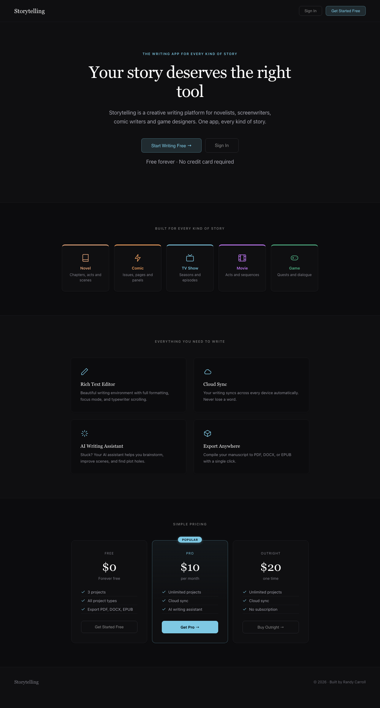
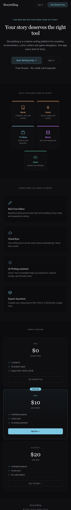

# Storytelling

A creative writing platform for novelists, screenwriters, comic writers and game designers. One app, every kind of story.



## Features

- **Every kind of story** — Novel (chapters, acts, scenes), Comic (issues, pages, panels), TV Show (seasons, episodes), Movie (acts, sequences) and Game (quests, dialogue) project types.
- **Rich text editor** — Tiptap-based writing environment with full formatting, focus mode and typewriter scrolling.
- **Cloud sync** — projects and documents are saved to a backend and available on every device.
- **AI writing assistant** — brainstorm, improve scenes and find plot holes.
- **Export anywhere** — compile your manuscript to PDF, DOCX or EPUB.
- **Desktop app** — packaged with Tauri alongside the web build.

### Pricing tiers

| Plan | Price | Includes |
| --- | --- | --- |
| Free | $0 | 3 projects, all project types, PDF/DOCX/EPUB export |
| Pro | $10 / month | Unlimited projects, cloud sync, AI assistant |
| Outright | $20 one time | Unlimited projects, cloud sync, no subscription |

## Responsive landing page

The landing page is fully responsive, with accessible focus states and reduced-motion support.



## Tech stack

- [React 19](https://react.dev) + [Vite](https://vite.dev)
- [Clerk](https://clerk.com) for authentication
- [Stripe](https://stripe.com) for payments
- [Tiptap](https://tiptap.dev) for the editor
- `jspdf`, `docx` and `epub-gen-memory` for export
- [Tauri](https://tauri.app) for the desktop build

## Getting started

```bash
npm install
```

Create a `.env` file in the project root:

```bash
VITE_CLERK_PUBLISHABLE_KEY=your_clerk_publishable_key
VITE_STRIPE_PUBLISHABLE_KEY=your_stripe_publishable_key
```

Then start the dev server at http://localhost:5173:

```bash
npm run dev
```

### Scripts

| Command | Description |
| --- | --- |
| `npm run dev` | Start the Vite dev server |
| `npm run build` | Build for production into `dist/` |
| `npm run preview` | Preview the production build |
| `npm run lint` | Run ESLint |

## Project structure

```
src/
  Landing.jsx      Landing page for signed-out visitors
  Home.jsx         Project dashboard
  Editor.jsx       Writing editor
  Sidebar.jsx      Project navigation
  Outline.jsx      Outline view
  Corkboard.jsx    Corkboard view
  CharacterSheet.jsx
  AIAssistant.jsx  AI writing assistant
  Compile.jsx      PDF / DOCX / EPUB export
  Pricing.jsx      Plans and checkout
  api.js           Backend API client
src-tauri/         Tauri desktop shell
docs/screenshots/  README images
```

## Author

Built by Randy Carroll.
